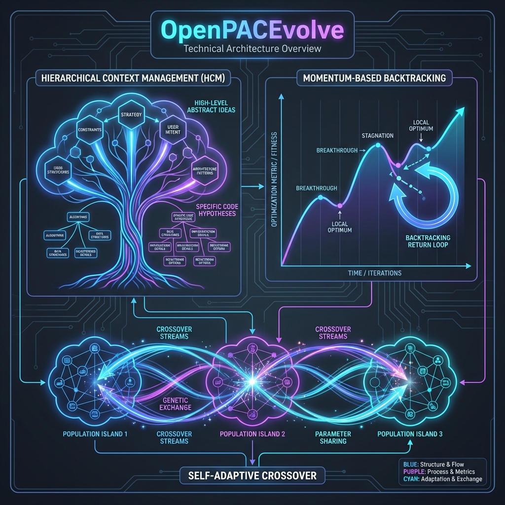

# OpenPACEvolve


[](https://opensource.org/licenses/Apache-2.0)
[](https://www.python.org/downloads/release/python-3100/)
[](http://makeapullrequest.com)

**Open-source implementation of PACEvolve - Progress-Aware Consistent Evolution**

OpenPACEvolve is an evolutionary coding agent framework that evolves programs to optimize for user-defined metrics. It implements the PACEvolve algorithm which addresses three key challenges in evolutionary agents:



- **Context Pollution** → Hierarchical Context Management (HCM)
- **Mode Collapse** → Momentum-Based Backtracking (MBB)
- **Weak Collaboration** → Self-Adaptive Crossover Sampling

> [!WARNING]
> **Development Phase**: This project is currently in active development. Features and APIs are subject to change. Use with caution in production environments.

## Quick Start

```bash
# Install
pip install -e .

# Set API key
export OPENAI_API_KEY="your-key"  # Works with Gemini via OpenAI-compatible API

# Run evolution
python openpacevolve-run.py \
    examples/function_minimization/initial_program.py \
    examples/function_minimization/evaluator.py \
    --config examples/function_minimization/config.yaml \
    --iterations 20
```

## Features

### 1. Hierarchical Context Management (HCM)

Separates high-level **Ideas** from specific **Hypotheses**:
- Ideas represent conceptual approaches (e.g., "Use simulated annealing")
- Hypotheses are specific implementations of those ideas
- Bi-level pruning with LLM-based summarization
- Persistent failure memory to avoid known bad approaches

### 2. Momentum-Based Backtracking (MBB)

Prevents getting stuck via real-time progress monitoring:
- **Relative Progress (Rt)**: Scale-invariant improvement measure
- **EWMA Momentum**: Smoothed progress tracking
- **Power-law Backtracking**: Intelligent state reversion when stuck

### 3. Self-Adaptive Crossover Sampling

Enables effective collaboration between islands:
- **Weighted crossover based on island progress**
- **Synergy bonus for high-performing similar islands**
- **Probabilistic action selection (crossover vs backtrack)**

## Configuration

```yaml
# config.yaml
max_iterations: 100

llm:
  models:
    - name: "gemini-2.0-flash-lite"
      weight: 0.8
    - name: "gemini-2.0-flash"
      weight: 0.2
  api_base: "https://generativelanguage.googleapis.com/v1beta/openai/"

database:
  num_islands: 5
  migration_interval: 50

momentum:
  beta: 0.9
  intervention_threshold: 0.1
```

## Python API

```python
from pacevolve import OpenPACEvolve, run_evolution

# Option 1: Full control
evolve = OpenPACEvolve(
    initial_program_path="program.py",
    evaluator_path="evaluator.py",
    config_path="config.yaml",
)
best = evolve.run(iterations=50)

# Option 2: Quick run
best = run_evolution(
    initial_program="program.py",
    evaluator="evaluator.py",
    iterations=30,
)
```

## Writing an Evaluator

```python
# evaluator.py
def evaluate(program_path):
    """Return metrics dict with 'combined_score' key."""
    # Load and run the program
    # Return evaluation results
    return {
        "metrics": {
            "combined_score": 0.85,  # Required
            "accuracy": 0.9,
            "speed": 0.8,
        },
        "artifacts": {
            "feedback": "Good improvement in accuracy",
        }
    }
```

## Project Structure

```
pacevolve/
├── context/          # Hierarchical Context Management
│   ├── idea_pool.py
│   ├── hypothesis.py
│   └── failure_memory.py
├── momentum/         # Momentum-Based Backtracking
│   ├── progress.py
│   └── backtracking.py
├── sampling/         # Self-Adaptive Crossover
│   ├── action_weights.py
│   └── crossover.py
├── llm/              # LLM integration
├── prompt/           # Prompt engineering
├── controller.py     # Main orchestrator
├── database.py       # Island-based storage
└── api.py            # Public API
```

## Roadmap

- [ ] **Vector Database**: Add semantic search for efficient idea deduplication and crossover.
- [ ] **Web UI Visualizer**: Real-time dashboard for evolution monitoring.
- [ ] **Safety Handlers**: JSON-based IPC to replace pickle for security.
- [ ] **Test Suite**: Comprehensive unit tests for core modules.

## Requirements

- Python 3.10+
- OpenAI API key (works with Gemini, OpenAI, local models)

## License

Apache-2.0

## Citation

If you use OpenPACEvolve in your research, please cite:

```bibtex
@software{openpacevolve2025,
  author = {Hassen Hamdi},
  title = {OpenPACEvolve: an open source mature implementation of PACEvolve},
  year = {2025},
  url = {https://github.com/HassenHamdi/OpenPACEvolve}
}
```
